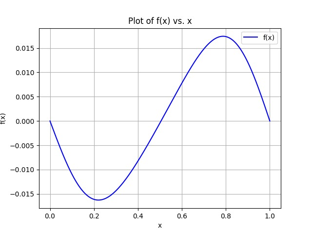
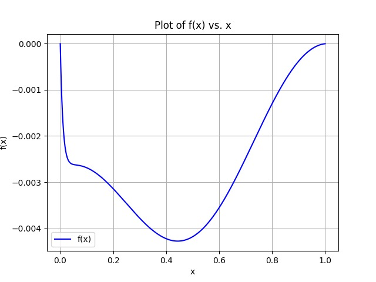
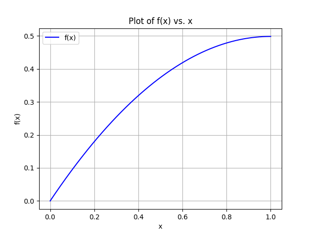
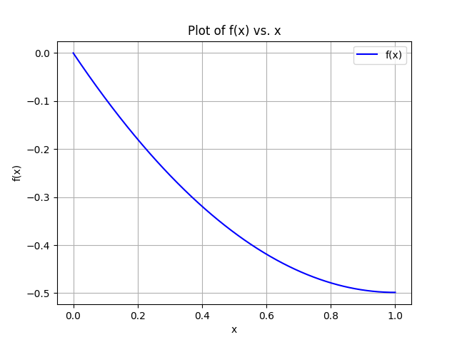

# Fem1d
1D Finite Element

## How to run

```
$ mkdir build     # if build directory does not exist
$ cd build
$ cmake ..
$ make 
$ ./17_fem1d_17_fem1d <Length of domain> <Number of nodes>
```

## What is it?

The Finite Element Method (FEM) is a numerical method used to solve partial differential equations in problems ranging from one-dimensional to multi-dimensional. 

FEM works by dividing the system into small parts, called finite elements, and discretizing the space using a mesh. This converts a boundary value problem into a system of algebraic equations. The method estimates the unknown function over the domain by assembling equations for the finite elements into a larger system that represents the entire problem. FEM then finds an approximate solution by minimizing an associated error function using the calculus of variations.


## How does it work?

We implemented a program capable of solving partial differential equations problems in one dimension.

#### BOUNDARY_COND 

This class abstracts the boundary condition on a domain element. For the 1d case, it corresponds to the condition on a single extremal point. It is constructed via a boolean to distinguish the type of condition (true for Neumann, false for Dirichlet), and the corresponding function representing the condition. Notice that for a 1d problem these are numerical values, but we implemented them as functions for greater flexibilities looking at future implementations.
It exposes only the basic getter methods.

#### FUNCTION
All the functions of the program are implemented using a specific class characterized by two attributes: one for the function itself and one for its gradient (defined as std functions). Then there are two constructors: the first one needs both the attributes while the second one requires only the function because the gradient is defaulted to zero (i.e. the zero function). The second constructor is used when we do not need to specify the gradient (e.g. for the quadratures). Subsequently, there are two simple functions just to obtain the value of the function and the gradient in a specific position. We specified also 4 operators respectively for defining the sum and the multiplication.

#### FEM1D 
The most important class is fem1d. It is responsible of handling all the data of the problem, building the algebraic linear system associated to the analytical PDE through finite element method. This is done through
<ul>
    <li>Constructor: takes all input data for the problem.
    In particular, it takes already instantiated objects for attributes mesh, forcing_term, reaction_term, diffusion_term and transport term. Also a couple of boolean value and Function object is taken for the 2 extremal points of the 1d domain, specifying the type of boundary condition (true for Neumann, false for Dirichlet) and its value, and instantiating the corresponding BoundaryCond objects (in an array of size 2).
    </li>
    <li>Assemble method: actually computes the matrix and rhs of the system, by applying fem and by using quadrature method to compute numerically the integrals.</li>
    <li>Solve method: implements Thomas algorithm to solve the linear system defined by the computed matrix and rhs.
    It has 2 overloads, one version without parameters and another one with an ofstream input. The latter executes the former, and subsequently writes the solution in a file in CSV format, listing x points and corresponding computed values of the approximated solution.</li>
    <li>GetSolution method: getter to retrive the computed solution.</li>
</ul>


#### GRID1D 
This class abstract the mesh in 1d. The domain is described by the 2 extrema (start, end) and the number of nodes in which to divide it. The constructor of the class computes and stores the mesh size (h).
Besides the basic getters, it exposes an overload of the call operator, which returns value of the k-th node.
There is also the getPhiFunctions method, which returns a vector of the basis functions of fem for the grid, in the order of the corresponding nodes.

#### PHI_FUNCTION
A specialization of Function that only takes the Grid and the node index. 
Defines the basis function of FEM with grade 1 (linear) around the given node index. 

#### QUADRATURE
We implemented this class using inerithance with the aim of defining four different types of quadrature (MidPoint, Trapezoidal, Simpson and TwoPoints) just overriding the same method ("integrate") that just requires the two extrema of the interval we want to integrate on. The only attribute of the class is the function used for the integration and is the only parameter passed to the constructor for building an instance of this class.

#### THOMAS
This class is implemented to solve the problem with the Thomas algorithm. The constructor is the default one because it doesn't need any attributes.
In solve, Thomas algorithm is implemented by splitting the problem in forward and backward substitution, both implemented and used as private in the class.

## What to do next?

- Modify the program in order to solve PDE problems also in  2D or 3D.
- Generalize some classes like Function, BoundaryCond
- Parallelize the program by changing Thomas algorithm or through domain decomposition.

## Our results 
### Dirichlet problems, u(0)=u(1)=0
Forcing = $sin(2 \pi x)$ <br>
Diffusion term = 1 <br>
Transport term = 0 <br>
Reaction term = 0 <br>


<br><br>
Forcing = $sin(2 \pi x)$ <br>
Diffusion term = 1 <br>
Transport term = 100 <br>
Reaction term = -100 <br>


### Dirichlet-Neumann u(0)=0 , u'(1)=0
Forcing = +1 <br>
Diffusion term = 1 <br>
Transport term = 0 <br>
Reaction term = 0 <br>


<br><br>
Forcing = -1 <br>
Diffusion term = 1 <br>
Transport term = 0 <br>
Reaction term = 0 <br>

